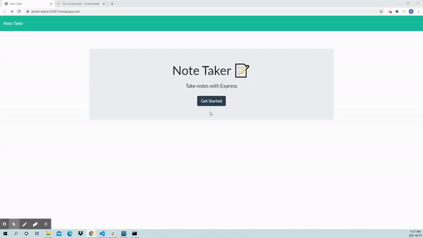
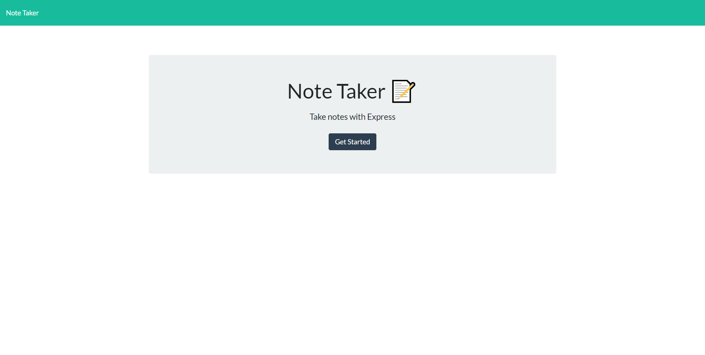
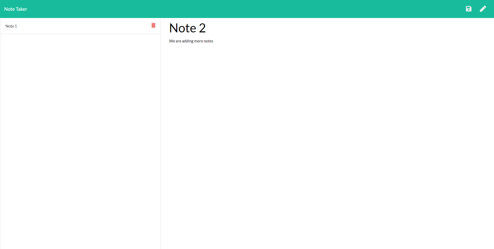

<h1 align=center>Note Taker</h1>

<p align="center">
 <a href=""></a>
 <a href=""></a>
 <a href=""></a>
 <a href=""></a>
 <a href=""></a>
 <a href="https://github.com/nashwalters"></a>
</p>

## Table of Contents
* [Description](#description)
* [Installation](#installation)
  * [Expressjs](#expressjs)
  * [FS Module](#fs-module)
* [Deployment](#deployment)
* [Usage](#usage)
  * [Screenshots](#screenshots)
  * [Tips](#tips)
* [Contributing](#contributing)
* [Questions](#questions)
* [Credits](#credits)
* [License](#license)

## Description
Have you ever tried to recall something important, but you just can't remember the information you need? Keeping notes is an option that will allow you to have written information when needed. It is believed that note-taking boosts memory and the ability to retain and understand concepts. However, why just use pen and paper when you can use a simple note taking app made with express.js and deploped with Heroku.

This note taker allows the user to create and save notes, view previuosly saved notes and delete previously saved notes and is useful as it allows the user to organize their thoughts and keep track of information/ tasks that are important.

## Installation
Node.js is required ([See download information here](https://nodejs.org/en/download/)). The app uses express.js and the node fs module.

### Expressjs
[Express](https://expressjs.com/) is a minimal and flexible Node.js web application framework. It's features include: robust routing, super-high test coverage and HTTP helpers (redirection, caching, etc). Run the comman below in terminal to install express.
```
$ npm i express
```
### FS Module
The [FS Module](https://nodejs.org/api/fs.html)comes with node.js. It allows you to work with the file system on your computer. It is used to read, create, update, delete and rename files
To include the File System module, use the require() method:
```
const fs = require('fs')
```

## Deployment 
[Heroku](https://www.heroku.com/what) allows developers to deploy and manage their apps.

[Click here to deploy app](https://secret-island-62587.herokuapp.com/)
 
## Usage
The user is taken to a home page where they are able to click on the get started button. This button takes the user to another page that where thet are ablle to create/ add a note. Once the note is saved, the title of the saved note is visible ant the user can click on the saved note to see the contents of the note or click on the trash can to delete the note. The user is able to add as many notes ant they would like. 

#### Screenshots





#### Tips
1. You are able to clone this repo or download a zip file to your local machine.

2. If you have cloned a repo and a package.json exists, you are able to see the dependencies and dev dependecies used in the application. If this is the case run the below comand to get all the depencies need for that application.
```
$ npm i
```
3. When using Heroku to deploy your app ensure that your `package.json` file is set up correctly. It must have a `start` script and all the project's dependencies defined. E.g.:
```
  },
     "scripts": {
       "start": "node server.js"
     }
   }
```
## Contributing
Please first discuss the change you wish to make via issue or email, before making a change.

Steps to contribute: 
1. Fork the repo on GitHub.
2. Clone the project to your own machine.
3. Commit changes to your own branch.
4. Push your work back up to your fork/branch
5. Submit a Pull Request so that we can review your changes

## Questions  
If you have any questions, I can be reached via:
* <bold>Email</bold>: nash.walters@outlook.com

## Credits
* [Adam Simonini](https://github.com/adamsimonini)
* Carleton University Coding Bootcamp

## License
Copyright © 2021 Nash Walters,

Released under the [MIT](https://github.com/nashwalters/eng-team-generator/blob/main/LICENSE) license.
